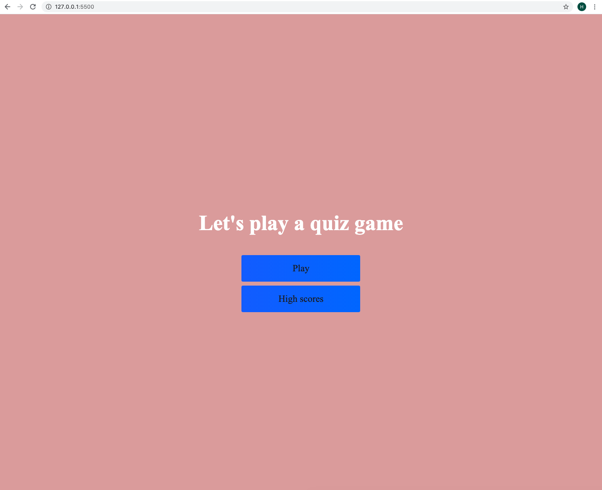
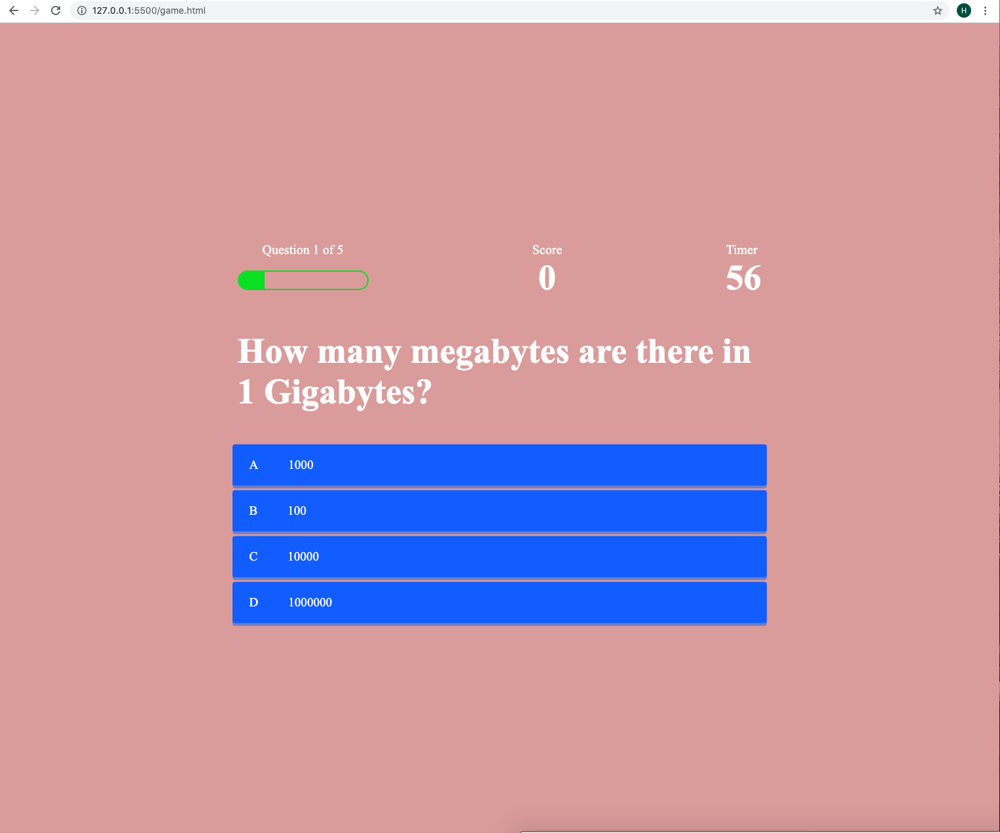
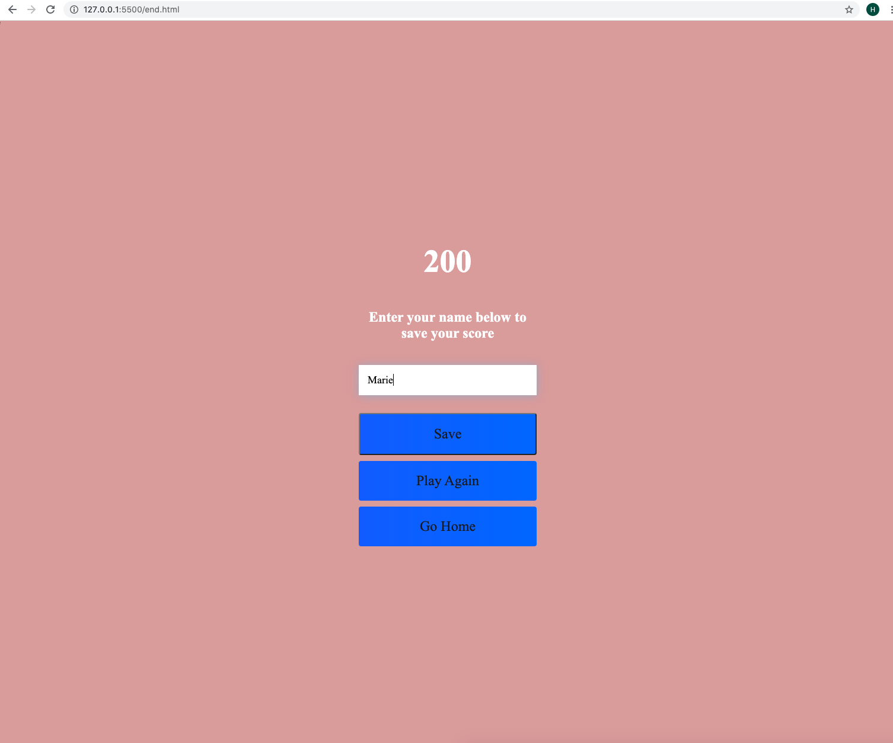
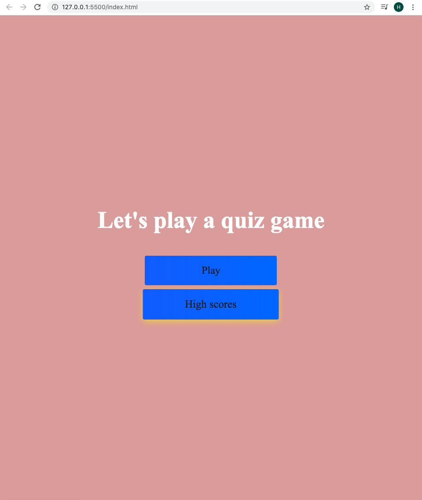
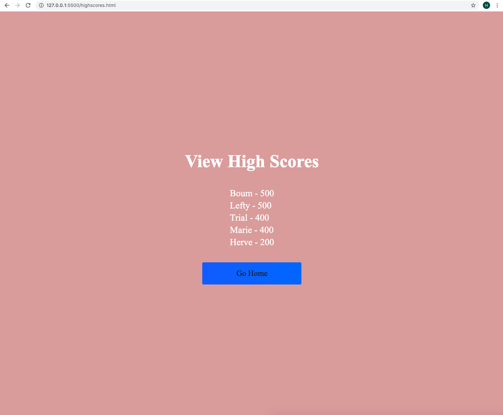

# Quiz-game application

##Given a user takes a code quiz, and clicks on the start button on the home page

##The user receives a series of five questions. A timer starts and also the score is increments by 100 points each time the user answers a question correctly.

##The the user is presented with another question. When the user answers a question incorrectly the timer is decreased by 3 seconds. 

##WHEN the game is over, the the user can save his or her initials and score

##After the game is. over. user can click on "View Highscores" button

##The highscores page opens and user can view a list of high scores

